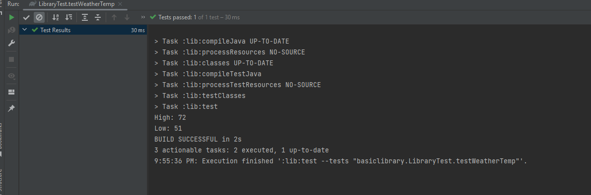
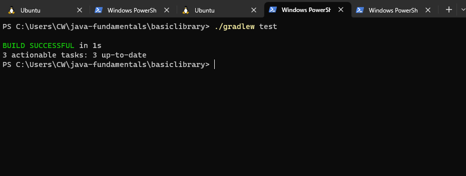
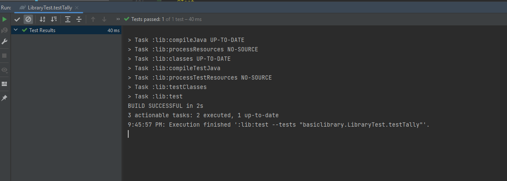

# java-fundamentals
# lab 1
 ## Primitive Data Types: 
 1.Numeric Types like byte ,short int ,long ,float and double .
 2.Boolean Type
 3.Character Type
 ## Function :A block of code that performs a specific task or operation.
 ## Loops : A control structure that repeats a block of code until a certain condition is met.
 such as while loop and for loop 

## output for the Pluralize function and Flipping Coins function:

## output for the Clock function

## Time solving the lab:
I took time to deal with java and new keyWords like main , class ,and took time to deal with write functions in java. it took 5 hours  

----------------------------------------------------------------------------------------
# lab 2 :
1. The first thing we deal with IntelliJ, and use Gradle with IntelliJ IDEA  -type java-library
2. create methods 
Rolling Dice :method should return an array containing the values of the rolls.
Contains Duplicates : returns true or false depending on whether the array contains duplicate values.
Calculating Averages :calculates and returns the average of all the values in the array.
 Arrays of Arrays:calculate the average value for each array and return the array with the lowest average.
3. then we take TDD 'Testing Development Driven' it's a methodology to test your application.
and deal with Arrange/Act/Assertions >> to test your code.

### output for the methods 

## output for the testing

## Time solving the lab
the function not toke time but the testing to deal with it it took time >> 6 -7 hours 

-------------------------------------------------------------------------------------
# lab 3 :
In the lecture we learned:
HashMap: allows you to store key-value pairs ,Keys must be unique does not have duplicated, HashSet: It is used to store a collection of unique elements with no duplicates.
Java packages: we learned the different between
packages: organize and access code and structure classes and to use classes from other packages you need to import. 
and some packages it automatically import like java. Lang.
we took the types of packages :public , protected ,default and private and took the difference between  them.
File I/O and Paths: I/O mean input/ output 
we took the paths like absolute path that go to the root directory and the relative path that in the same directory you are work with.
then we took the scanner where you can read the files whether line by line or word by word ...else  
Exception handling:>>>>error are handled by throwing and or try and catch >>>we have run time expectation and compiled time expectation 
### output for the methods 

## outputs for linter

## Time solving the lab
the function not toke time but the testing to deal with it it took time >> 6 -7 hours 
but the testing for File I/O I dont understood

