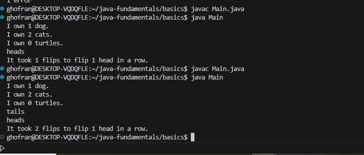
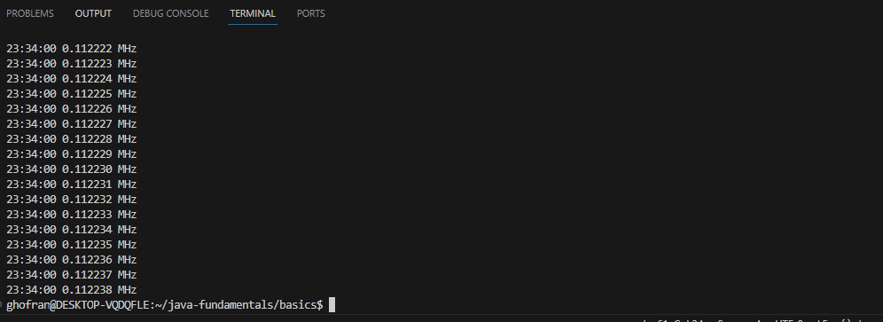

# java-fundamentals
 # In this lab we started studying
 ## Primitive Data Types: 
 1.Numeric Types like byte ,short int ,long ,float and double .
 2.Boolean Type
 3.Character Type
 ## Function :A block of code that performs a specific task or operation.
 ## Loops : A control structure that repeats a block of code until a certain condition is met.
 such as while loop and for loop 

## output for the Pluralize function and Flipping Coins function:

## output for the Clock function

## Time solving the lab:
I took time to deal with java and new keyWords like main , class ,and took time to deal with write functions in java. it took 5 hours  

