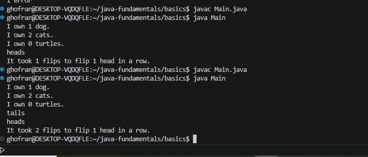
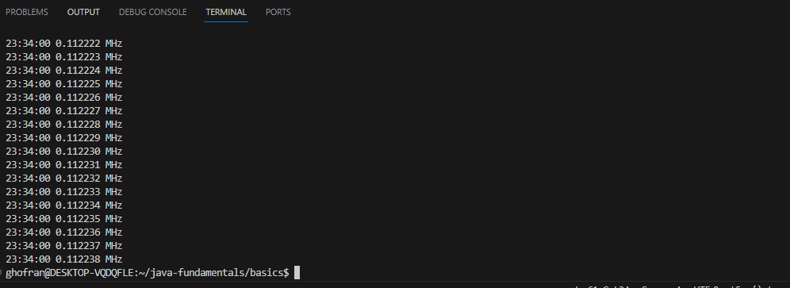
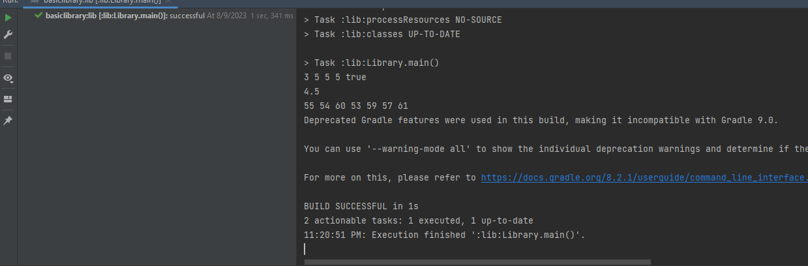
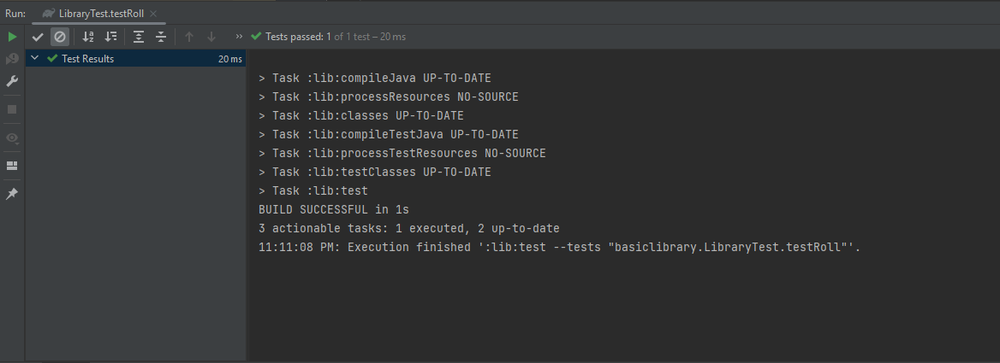
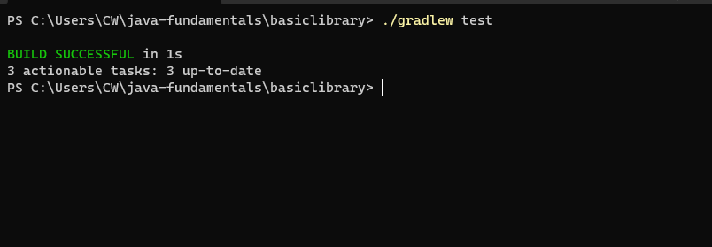

# java-fundamentals
# lab 1
 ## Primitive Data Types: 
 1.Numeric Types like byte ,short int ,long ,float and double .
 2.Boolean Type
 3.Character Type
 ## Function :A block of code that performs a specific task or operation.
 ## Loops : A control structure that repeats a block of code until a certain condition is met.
 such as while loop and for loop 

## output for the Pluralize function and Flipping Coins function:

## output for the Clock function

## Time solving the lab:
I took time to deal with java and new keyWords like main , class ,and took time to deal with write functions in java. it took 5 hours  

----------------------------------------------------------------------------------------
# lab 2 :
1. The first thing we deal with IntelliJ, and use Gradle with IntelliJ IDEA  -type java-library
2. create methods Rolling Dice,Contains Duplicates,Calculating Averages,and Arrays of Arrays.

3. then we take TDD 'Testing Development Driven' it's a methodology to test your application.
and deal with Arrange/Act/Assertions >> to test your code.

### output for the methods 

## output for the testing

## Time solving the lab
the function not toke time but the testing to deal with it it took time >> 6 -7 hours 

